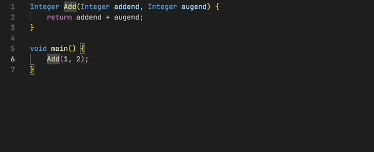
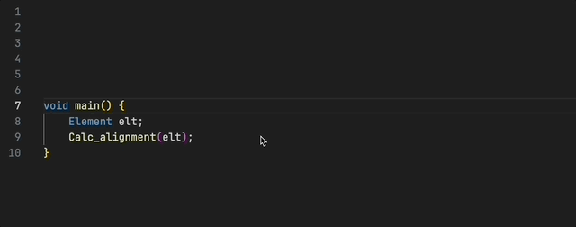
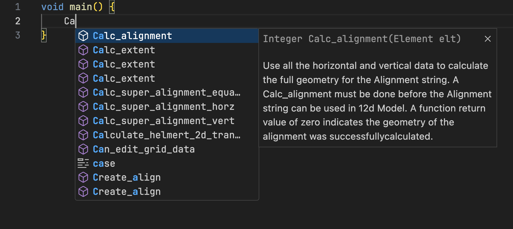
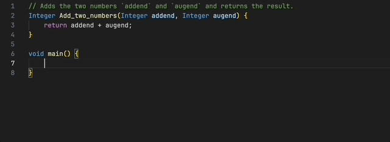

# 12d Programming Language for Visual Studio Code

Visual Studio Code Extension providing language support for the 12d Programming
Language.

Supports declarations across `#include` files if the `includesDir` is
configured, see [configuration](#configuration).

## Requirements

- Visual Studio Code v1.75.0+.

## Features

### Go to definition

Jump to or peek at definition of symbol.

### Hover support

Get symbol information (type, signature and documentation) on hover over symbol.
Works for built in 12d and user defined symbols. Function documentation for
user defined functions are provided if a comment block ends directly above the
function declaration.

### Autocompletion

Provide completion suggestions as you write your code.

## Planned Features

- Find references.
- Autoformatting.

## Configuration

You can configure the extension by [editing the settings inside of VS
Code](https://code.visualstudio.com/docs/getstarted/settings#_settings-editor).

